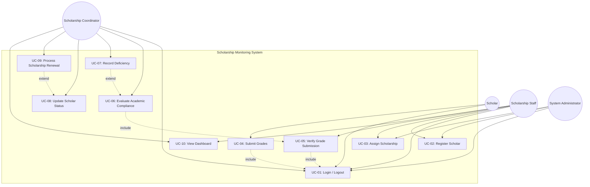

# SYSTEMS ANALYSIS AND DESIGN
## Student Scholarship Monitoring and Academic Compliance System
**Part I: Systems Analysis & Design • Part II: 2.5-Hour System Development Laboratory**

---

## Executive Summary & System Overview

The **Student Scholarship Monitoring and Academic Compliance System** (**ScholarPulse**) is a centralized web platform designed to streamline and automate university scholarship management. It handles scholar registration, scholarship program requirement configuration, semester grade submission, transcript verification by authorized staff, automated compliance evaluation against program-specific rules, deficiency tracking, scholar status management, and live executive dashboard monitoring.

- **Working Local App Server:** `http://localhost:8080/`
- **Supabase Backend Project URL:** `https://cglwrlpqgafocqwsfnuu.supabase.co`
- **Supabase Publishable Key:** `sb_publishable_2J4UyR4xlAX-frHQ6yaZ3g_99mezWqL`
- **Frontend Stack:** HTML5, Modern Glassmorphic Vanilla CSS3, JavaScript (ES6+), Supabase JS SDK, Chart.js, Mermaid.js
- **Backend/Database:** Supabase PostgreSQL (`profiles`, `scholarship_programs`, `scholars`, `grade_submissions`) with LocalStorage Persistence
- **Deployment Target:** GitHub Pages / Supabase Cloud

---

# PART I — REQUIREMENTS ANALYSIS AND USE CASE MODELING

### A. Problem Analysis (Manual vs Centralized Process)

| No. | Problem Identified | Root Cause | Systemic Effect / Impact |
| :---: | :--- | :--- | :--- |
| **1** | **Delayed Deficiency Identification** | Manual review using paper transcripts & spreadsheets | Scholars receive grant stipends for semesters after losing eligibility, causing severe financial overpayments. |
| **2** | **Fragmented Scholar Profiles** | Data stored in disparate Excel files across offices | High data redundancy, conflicting scholar records, and missing historical academic compliance records. |
| **3** | **Inconsistent Rules Enforcement** | Varying cutoffs (Merit vs Needs-based GWA) checked by hand | Human evaluation errors, unfair grant renewals, and student grievances due to subjective decisions. |
| **4** | **Unverified Grade Submissions** | Lack of verification step before approving submissions | Tampered or unverified self-reported grades used for final scholarship compliance evaluation. |
| **5** | **Lack of Auditability & Traceability** | No change logging or history of record modifications | Inability to trace who approved/altered a grade record or overridden compliance status. |
| **6** | **High Staff Workload & Bottlenecks** | Manual computation of GWA & unit loads at peak enrollment | Processing backlogs, delayed clearance for enrollment, and administrative exhaustion. |
| **7** | **Poor Visibility for Stakeholders** | No self-service portal for scholars to view compliance | Excessive student inquiry calls/emails and missed deadlines for grade submission. |
| **8** | **Inaccurate Management Reporting** | Manual aggregation of scholarship statistics for donors | Inaccurate reporting on total active scholars, retention rates, and fund distribution. |

---

### B. Stakeholder and Actor Analysis

| Stakeholder | Information Needed | Responsibility | Actor? | Why? |
| :--- | :--- | :--- | :---: | :--- |
| **Scholar** | Status, program rules, submission deadlines, deficiency notices | Submits semester grades, uploads proof, maintains GWA & unit load | **YES** | Interacts directly with system to log in, view requirements, and submit grades. |
| **Scholarship Staff** | Pending submissions, scholar profiles, transcripts, deficiency flags | Registers scholars, verifies grade submissions, issues deficiency notices | **YES** | Primary operational user responsible for data entry, verification, and daily workflow execution. |
| **Scholarship Coordinator** | Compliance reports, probationary trends, verification logs, criteria | Evaluates compliance, oversees renewal processing, configures criteria | **YES** | Executed compliance evaluation, manages program requirements, and processes renewals. |
| **Scholarship Committee** | Aggregated scholarship statistics, renewal summaries, appeals | Makes final decisions on appeals, grant revocations, and annual funding | **NO** | Receives summary reports generated by system; does not execute direct system transactions. |
| **Registrar** | Official transcripts, validated unit counts, official GWA records | Validates student enrollment status and provides official grade data | **NO** | External entity / data source whose official records are cross-referenced during verification. |
| **System Administrator** | Audit logs, user permissions, database health, auth settings | Manages user roles, system settings, backup security, and access control | **YES** | Interacts directly with system to manage user accounts, roles, permissions, and security. |

---

### C. Requirements Elicitation (12 Structured Interview Questions)

1. **Current Workflow:** What exact step-by-step procedures are currently followed from scholar registration to end-of-semester evaluation?
2. **Grade Submission:** How do scholars submit semester grades, and what supporting proof (e.g. TCG, portal screenshot) is required?
3. **Deadline Enforcement:** What happens when a scholar fails to submit grades within the prescribed submission deadline?
4. **Scholarship Criteria:** How do academic requirements (GWA threshold, minimum units, failing grade rules) differ between Merit, University, and Private grants?
5. **Grade Verification:** What specific verification checks must staff perform before a grade submission is marked as authentic?
6. **Deficiency Handling:** What constitutes a deficiency, and how are conditional/probationary statuses granted versus immediate disqualification?
7. **Renewal Process:** What criteria and approval workflow govern the transition from "For Renewal" to "Renewed" for the upcoming academic year?
8. **Notification & Alerts:** How are scholars notified regarding pending submissions, deficiency warnings, or status changes?
9. **Reporting Requirements:** What specific summaries or compliance breakdown reports are required by executive management and sponsors?
10. **Access Control:** Who should have authorization to modify verified grades, override compliance decisions, or configure program criteria?
11. **Auditability:** What details must be logged when an authorized user modifies a verified grade or overrides a scholar's status?
12. **System Integration:** How should the system integrate with existing user authentication (Supabase Auth / Student ID accounts)?

---

### D. Functional Requirements

- **FR-01:** The system shall allow authorized staff to register scholar records.
- **FR-02:** The system shall associate a scholar with a scholarship program.
- **FR-03:** The system shall maintain academic requirements for each scholarship program.
- **FR-04:** The system shall allow semester grade submission.
- **FR-05:** The system shall record the academic year and semester of every submission.
- **FR-06:** The system shall allow authorized staff to verify a grade submission.
- **FR-07:** The system shall evaluate verified academic information against scholarship requirements.
- **FR-08:** The system shall identify deficiencies.
- **FR-09:** The system shall maintain scholar status.
- **FR-10:** The system shall identify pending grade submissions.
- **FR-11:** The system shall allow authorized users to search scholars by Student ID or Name.
- **FR-12:** The system shall allow filtering of scholars by scholarship program and compliance status.
- **FR-13:** The system shall display real-time dashboard monitoring counts for key academic metrics.
- **FR-14:** The system shall log verification actions including verifier identity and timestamp.
- **FR-15:** The system shall support scholarship renewal processing for eligible compliant scholars.

---

### E. Non-Functional Requirements

- **NFR-01 (Security):** Role-based access control (RBAC) preventing unauthorized users from verifying grades or altering scholar profiles.
- **NFR-02 (Privacy):** Sensitive scholar grade details must be protected and visible only to authorized staff, coordinators, and the respective scholar.
- **NFR-03 (Usability):** The user interface shall be intuitive, responsive, and provide immediate visual feedback for verification and compliance status.
- **NFR-04 (Performance):** Dashboard counts, search results, and batch compliance calculations must render within 2 seconds.
- **NFR-05 (Reliability):** Database state and local storage fallback shall maintain transactional consistency across page refreshes.
- **NFR-06 (Data Integrity):** Duplicate Student IDs shall be blocked, and grade submission values must strictly conform to institutional bounds.

---

### F. Business Rules

- **BR-01:** Every scholar must be assigned to an active scholarship program.
- **BR-02:** Every scholarship program must define its academic requirements (Required GWA, Minimum Units, Failing Grade Policy).
- **BR-03:** A grade submission must belong to one scholar, academic year, and semester.
- **BR-04:** Only authorized personnel (Staff / Admin / Coordinator) may verify submitted grades.
- **BR-05:** Only verified submissions may be used for final compliance evaluation.
- **BR-06:** A scholar cannot be marked Compliant while mandatory requirements or verified grades are incomplete.
- **BR-07:** Scholar status must be dynamically based on the rules of the assigned scholarship program.
- **BR-08:** Changes to verified academic records must be traceable (`verified_by` and `verified_at` timestamped).
- **BR-09:** A submission cannot be verified twice without an authorized correction process.
- **BR-10:** Sensitive grade information must only be visible to authorized users.

---

### G. Required Scholar Status Definitions

| Status | Condition / Trigger Definition |
| :--- | :--- |
| **Active** | Scholar is registered and currently enrolled in an active scholarship program. |
| **Pending Submission** | Scholar has not yet submitted semester grades for the active academic term. |
| **For Verification** | Grade submission received; awaiting review and verification by authorized staff. |
| **Compliant** | Verified grade submission satisfies all program requirements (GWA, Units, Failing policy). |
| **With Deficiency** | Verified submission fails at least one criteria (e.g., GWA too high, low units, failing grade). |
| **Probationary** | Scholar incurred deficiencies in previous term and is placed on conditional status for 1 semester. |
| **For Renewal** | Compliant scholar at the end of the academic year awaiting annual grant renewal processing. |
| **Renewed** | Scholar renewal approved for the subsequent academic year. |
| **Disqualified** | Scholar failed probationary terms or committed severe academic policy violations. |

---

### H. Use Case Analysis & Diagram



---

### I. Detailed Use Cases

#### Detailed Use Case 1: Submit Grades (UC-04)
- **Primary Actor:** Scholar / Scholarship Staff
- **Goal:** Submit academic semester grades and unit loads for verification.
- **Preconditions:** User logged in; Scholar record exists and is assigned to an active scholarship program.
- **Trigger:** Scholar opens grade submission interface at the end of a semester.
- **Main Flow:**
  1. User selects scholar profile, academic year, and semester.
  2. User inputs GWA, units enrolled, count of failing subjects, and incomplete subjects.
  3. System validates input ranges (GWA between 1.00 and 5.00, non-negative unit & subject counts).
  4. System saves submission record with status set to `Pending`.
  5. System updates scholar status to `For Verification`.
- **Alternative Flow:** Staff submits grades on behalf of scholar during walk-in submission.
- **Exception Flow:** Invalid GWA format or blank mandatory fields trigger error validation alerts.
- **Postconditions:** Grade submission record created in database; dashboard pending queue updated.

#### Detailed Use Case 2: Verify Grade Submission (UC-05)
- **Primary Actor:** Scholarship Staff
- **Goal:** Verify authenticity of submitted grades against official transcript data.
- **Preconditions:** Submission exists in `Pending` status; user authenticated as Staff/Admin.
- **Trigger:** Staff clicks "Verify" on pending submission list.
- **Main Flow:**
  1. Staff reviews submitted GWA, unit load, and subject counts.
  2. Staff verifies against official registrar grade release.
  3. Staff clicks "Confirm & Verify".
  4. System records `verified_by` user ID and current timestamp `verified_at`.
  5. System updates submission status to `Verified`.
  6. System triggers automated compliance evaluation engine.
- **Alternative Flow:** Staff detects discrepancy and marks submission as `Returned` with remarks.
- **Postconditions:** Verified record is locked for final compliance evaluation (BR-05, BR-09).

---

### J. Requirements Traceability Matrix

| Requirement | Actor | Use Case | Business Rule | Implemented Feature |
| :--- | :--- | :--- | :--- | :--- |
| **FR-01** | Staff | Register Scholar | BR-01 | Scholar Registration Modal & Table View |
| **FR-02** | Staff | Assign Scholarship | BR-01 | Scholar Program Selection Dropdown |
| **FR-03** | Coordinator | Configure Criteria | BR-02 | Scholarship Program Manager Cards |
| **FR-04** | Scholar/Staff | Submit Grades | BR-03 | Semester Grade Submission Form |
| **FR-06** | Staff | Verify Grade Submission | BR-04, BR-05, BR-09 | Submissions Queue Verification Action |
| **FR-07** | Coordinator/System | Evaluate Academic Compliance | BR-05, BR-07 | Automated Compliance Evaluation Engine |
| **FR-08** | System | Record Deficiency | BR-06 | Deficiency Cause Alert Tags & Audit Log |
| **FR-10** | Staff | View Dashboard | BR-04 | Live Pending Queue Table & KPI Cards |
| **FR-11** | All Users | Search Scholar | BR-10 | Live Real-time Search Input Field |
| **FR-12** | All Users | Filter Scholars | BR-10 | Multi-Filter Dropdowns (Program & Status) |

---

# PART II — SYSTEM DEVELOPMENT LABORATORY

### Database Schema (Relational PostgreSQL Structure)

#### 1. `profiles`
- `id` (UUID / TEXT, PK): User ID
- `full_name` (TEXT): Full name of user
- `role` (TEXT): `admin` / `staff` / `coordinator` / `scholar`

#### 2. `scholarship_programs`
- `id` (TEXT, PK): Program Primary Key
- `program_name` (TEXT): Name of scholarship program
- `required_gwa` (NUMERIC): Maximum GWA allowed (e.g. 1.75)
- `min_units` (INTEGER): Minimum units required
- `allow_failing_grade` (BOOLEAN): Policy flag for failing grades
- `active` (BOOLEAN): Program active toggle

#### 3. `scholars`
- `id` (TEXT, PK): Scholar Primary Key
- `student_id` (TEXT, UNIQUE): Institutional Student Number
- `full_name` (TEXT): Scholar Full Name
- `degree_program` (TEXT): Academic Degree
- `year_level` (TEXT): Current Year Level
- `scholarship_id` (TEXT, FK -> scholarship_programs.id): Assigned Grant
- `status` (TEXT): Scholar Status

#### 4. `grade_submissions`
- `id` (TEXT, PK): Submission Primary Key
- `scholar_id` (TEXT, FK -> scholars.id): Scholar Reference
- `academic_year` (TEXT): Academic Year (e.g. 2025-2026)
- `semester` (TEXT): Term (e.g. 1st Semester)
- `gwa` (NUMERIC): Submitted GWA
- `units_enrolled` (INTEGER): Enrolled Units
- `failed_subjects` (INTEGER): Failed subjects count
- `incomplete_subjects` (INTEGER): Incomplete subjects count
- `submission_status` (TEXT): `Pending` / `Verified` / `Returned`
- `submitted_at` (TIMESTAMP): Date of submission
- `verified_by` (TEXT): Verifier user identity
- `verified_at` (TIMESTAMP): Date of verification

---

### Functional Test Suite Results (TC-01 to TC-10)

| Test ID | Test Scenario | Expected System Result | Result |
| :---: | :--- | :--- | :---: |
| **TC-01** | Login with valid authorized account | Dashboard opens with live KPI metrics | **PASS** |
| **TC-02** | Create scholar with complete data | Scholar saved and displayed in table | **PASS** |
| **TC-03** | Create scholar without Student ID | Submission rejected with validation error | **PASS** |
| **TC-04** | Submit semester grades | Record saved as Pending / For Verification | **PASS** |
| **TC-05** | Verify pending grade submission | Status becomes Verified with verifier log | **PASS** |
| **TC-06** | Evaluate scholar meeting requirements | Compliance engine tags status as Compliant | **PASS** |
| **TC-07** | Evaluate scholar failing a requirement | Result becomes With Deficiency with causes logged | **PASS** |
| **TC-08** | Search scholar by Student ID / Name | Matching records filtered dynamically | **PASS** |
| **TC-09** | Filter by scholarship / status | Correct subset displayed in real-time | **PASS** |
| **TC-10** | Open deployed URL on GitHub Pages | System fully functional online | **PASS** |

---

### Instructor Demonstration Guide (Quick 8-Step Walkthrough)

1. **Open App:** Launch `http://localhost:8080/` (or GitHub Pages URL).
2. **Dashboard Overview:** Observe 5 KPI cards (Total Scholars, Pending, Verified, Compliant, With Deficiency) and breakdown charts.
3. **Register New Scholar:** Navigate to **Scholars** -> Click **Register New Scholar** -> Enter Student ID `2026-99001`, Name `Gabriel Alonzo`, Degree `BS Computer Engineering`, Program `University Academic Excellence Grant` -> Save.
4. **Create Semester Grade Submission:** Navigate to **Submissions** -> Click **New Grade Submission** -> Select `Gabriel Alonzo`, AY `2025-2026`, Term `1st Semester`, GWA `1.40`, Units `21`, Fails `0` -> Submit.
5. **Demonstrate Pending Queue:** Show Gabriel Alonzo listed in **Pending Submissions** with status `Pending`.
6. **Verify Grade Submission:** As Staff/Admin, click **Verify** button. Observe status change to `Verified` with timestamp.
7. **Compliance Engine Auto-Evaluation:** Navigate to **Compliance Engine** tab. Verify Gabriel Alonzo is evaluated as `COMPLIANT` with status `Compliant`.
8. **Demonstrate Deficiency Trigger:** Edit Gabriel Alonzo's submission or program rules (e.g. increase GWA to `2.20` exceeding `1.75` limit or add a failing grade). Click **Re-Check**. Observe status automatically update to `With Deficiency` with specific deficiency reasons logged.

---

### Git Commit Log History (Part II Requirement XIX)

```bash
git commit -m "Initialize scholarship monitoring system codebase and project structure"
git commit -m "Configure Supabase tables, authentication, and scholar data models"
git commit -m "Implement grade submission and staff verification workflow"
git commit -m "Add compliance evaluation engine, live dashboard, search filters, and deployment"
```
